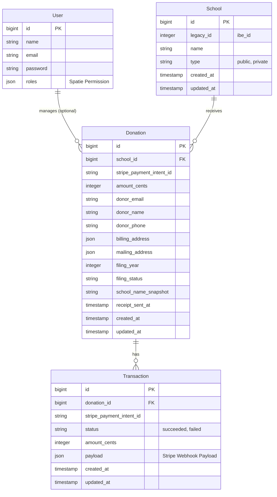

# Data Model: Migrate Legacy App Logic

**Feature**: `001-migrate-legacy-app`

## Entity Relationship Diagram



## Models & Schemas

### 1. User (Admin)
Standard Laravel User model with Spatie Permission traits.
- **Table**: `users`
- **Traits**: `HasRoles`

### 2. School
Beneficiary institution.
- **Table**: `schools`
- **Fillable**: `name`, `type`, `legacy_id`
- **Relationships**:
    - `donations()`: HasMany `Donation`

### 3. Donation
Core record of a contribution.
- **Table**: `donations`
- **Casts**:
    - `amount_cents`: `integer`
    - `billing_address`: `array` (or `Spatie\LaravelData\Data`)
    - `mailing_address`: `array` (or `Spatie\LaravelData\Data`)
    - `receipt_sent_at`: `datetime`
- **Relationships**:
    - `school()`: BelongsTo `School`
    - `transactions()`: HasMany `Transaction`

### 4. Transaction
Audit log of Stripe events.
- **Table**: `transactions`
- **Casts**:
    - `payload`: `array`
- **Relationships**:
    - `donation()`: BelongsTo `Donation`

## Data Transfer Objects (DTOs)

### DonationFormData
Used for validating and transferring data from the Inertia form to the Controller.

```php
class DonationFormData extends Data
{
    public function __construct(
        public int $school_id,
        public int $amount_cents,
        public string $donor_first_name,
        public string $donor_last_name,
        public string $donor_email,
        public string $donor_phone,
        public AddressData $billing_address,
        public ?AddressData $mailing_address,
        public int $filing_year,
        public string $filing_status,
        public string $payment_method_id, // From Stripe Elements
    ) {}
}
```

### AddressData
Reusable address structure.

```php
class AddressData extends Data
{
    public function __construct(
        public string $street,
        public string $city,
        public string $state,
        public string $zip,
        public string $country = 'US',
    ) {}
}
```
